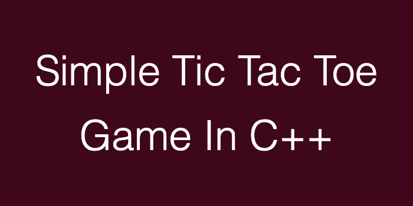
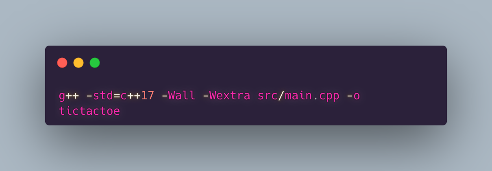

A terminal-based, two-player tic-tac-toe game built in C++, focused on practicing core language fundamentals — functions, 2D vectors, pass-by-reference, control flow, and a complete game loop with input validation and win/draw detection.

## How to build

## How to run 
\`\`\`bash
./tictactoe
\`\`\`

## Status 
:-D 
In progress 

